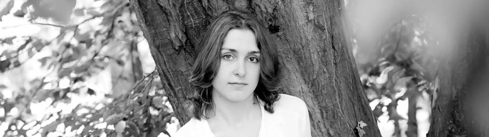

 

 

I am a postgraduate student in the University of Glasgow's
[Institute of Neuroscience and Psychology](http://www.gla.ac.uk/researchinstitutes/neurosciencepsychology/).
I work with [Dr. Christoph Scheepers](https://www.researchgate.net/profile/Christoph_Scheepers)

  
#Research interest:
My current research interest lies within the investigation of higher level language processing (semantics and pragmatics). Mainly, I am interested in how people create meaning when faced with ambiguous stimuli such as irony. My current project tries to uncover the processes by which people decide whether a written sentence is meant to be understood literally or ironically.

# Education:
##MSc, Research Methods of Psychological Science, University of Glasgow (Present)
I am currently researching how factors such as familiarity and emoticon use affect accuracy and affective processing in irony by using a mixture of behavioural and eye-tracking methods. The project is supervised by Dr. Christoph Scheepers.

##MA, Psychology (First Class), University of Glasgow (2017)
My dissertation project investigated the differential processing of positively and negatively framed ironic utterances using a reading time experiment. The project was supervised by Dr. Christoph Scheepers.

