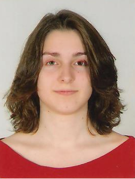

 I am a postgraduate student in the University of Glasgow's
[Institute of Neuroscience and Psychology](http://www.gla.ac.uk/researchinstitutes/neurosciencepsychology/).
I work with [Dr. Christoph Scheepers](https://www.researchgate.net/profile/Christoph_Scheepers)

\vspace{12pt}
 
  \vspace{12pt}

## EDUCATION:
###MSc, Research Methods of Psychological Science University of Glasgow (Present)
I am currently researching how factors such as familiarity and emoticon use affect accuracy and affective processing in irony by using a mixture of behavioural and eye-tracking methods. The project is supervised by Dr. Christoph Scheepers.

###MA, Psychology (First Class) University of Glasgow (2017)
Dissertation investigating the differential processing of positively and negatively framed ironic utterances using a reading time experiment. The project was supervised by Dr. Christoph Scheepers.

##RESEARCH EXPERIENCE:
###Research Intern for Second Language Processing Eye-Tracking Experiment (2017)
Assisted a PhD candidate with the examination of pupil dilation in response to emotional words in non-native English speakers. Determined eye-dominance, adjusted head-mounted eye-tracker and administered paper-based and online questionnaires.

